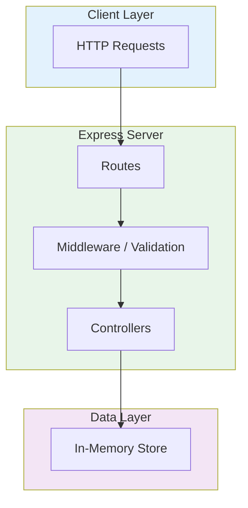

# Dio Bank API

[](https://typescriptlang.org)
[](https://nodejs.org)
[](https://expressjs.com)
[](https://jestjs.io)
[](LICENSE)
[](Dockerfile)
[](Dockerfile)

[English](#english) | [Portugues (BR)](#portugues-br)

---

## English

### Overview

Banking API built with Node.js, Express, and TypeScript as part of a DIO bootcamp challenge. Implements RESTful endpoints for account creation, balance inquiries, deposits, withdrawals, and statement management with in-memory data persistence and comprehensive input validation.

### Architecture



### Key Features

- **Account Management** -- Create, update, and delete banking accounts with CPF validation
- **Balance Operations** -- Real-time balance calculation from statement history
- **Deposit and Withdrawal** -- Credit and debit operations with validation rules
- **Statement History** -- Filterable transaction history with date-range queries
- **Input Validation** -- Middleware-based request validation for all endpoints
- **RESTful Design** -- Clean API endpoints following HTTP standards

### Industry Application

This project demonstrates core banking API patterns used in fintech applications, digital wallets, and payment platforms. The account and transaction management concepts apply directly to neobank MVPs, credit union systems, and financial microservices.

### Tech Stack

| Technology | Purpose |
|------------|---------|
| **TypeScript 5.0+** | Type-safe application logic |
| **Node.js** | Runtime environment |
| **Express** | HTTP framework |
| **Jest** | Testing framework |
| **Docker** | Containerized deployment |

### Quick Start

```bash
git clone https://github.com/galafis/Criando-a-API-do-Dio-Bank-Com-Node.git
cd Criando-a-API-do-Dio-Bank-Com-Node
npm install
npm run dev
```

### Docker

```bash
docker build -t dio-bank-api .
docker run -p 3000:3000 dio-bank-api
```

### Testing

```bash
npm test
```

### Project Structure

```
Criando-a-API-do-Dio-Bank-Com-Node/
├── src/
│   └── main.ts
├── tests/
├── Dockerfile
├── jest.config.js
├── package.json
├── tsconfig.json
└── LICENSE
```

### License

This project is licensed under the MIT License - see the [LICENSE](LICENSE) file for details.

### Author

**Gabriel Demetrios Lafis**
- GitHub: [@galafis](https://github.com/galafis)
- LinkedIn: [Gabriel Demetrios Lafis](https://linkedin.com/in/gabriel-demetrios-lafis)

---

## Portugues (BR)

### Visao Geral

API bancaria construida com Node.js, Express e TypeScript como parte de um desafio do bootcamp DIO. Implementa endpoints RESTful para criacao de contas, consultas de saldo, depositos, saques e gerenciamento de extratos com persistencia de dados em memoria e validacao abrangente de entrada.

### Principais Funcionalidades

- **Gerenciamento de Contas** -- Criar, atualizar e excluir contas bancarias com validacao de CPF
- **Operacoes de Saldo** -- Calculo de saldo em tempo real a partir do historico de extratos
- **Deposito e Saque** -- Operacoes de credito e debito com regras de validacao
- **Historico de Extratos** -- Historico de transacoes filtravel com consultas por intervalo de datas
- **Design RESTful** -- Endpoints de API limpos seguindo padroes HTTP

### Inicio Rapido

```bash
git clone https://github.com/galafis/Criando-a-API-do-Dio-Bank-Com-Node.git
cd Criando-a-API-do-Dio-Bank-Com-Node
npm install
npm run dev
```

### Testes

```bash
npm test
```

### Licenca

Este projeto esta licenciado sob a Licenca MIT - veja o arquivo [LICENSE](LICENSE) para detalhes.

### Autor

**Gabriel Demetrios Lafis**
- GitHub: [@galafis](https://github.com/galafis)
- LinkedIn: [Gabriel Demetrios Lafis](https://linkedin.com/in/gabriel-demetrios-lafis)
